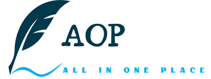

  
  <h2 style="border-bottom: 1px solid #d8dee4; color: #282d33;">GatherVerse</h2>

**GV : GatherVerse**
 
👨‍👩‍👦‍👦함께 한다면, 📈무한한 가능성을 만들어 냅니다

<h4>❓ 어떤 서비스 인가요?</h4>

- 코로나 팬더믹을 맞아 온라인 및 비대면 서비스가 확장되었습니다. 사람들 중 대면하는 공식적인 자리보다, 온라인 환경에서의 만남을 더 선호하는 유형이 많을 것 입니다. 이러한 사람들이 모여 무한한 가능성을 만들어 내는 것이 첫 번째 목표입니다.

- 실제 사회적으로, 온라인 및 비대면 서비스가 확장되며 대학 비대면 수업, zoom 회의 및 강의 등 새로운 유형의 학습 유형이 나타났으나, 한 쪽에서의 단방향 소통이나 기존 서비스를 더 편하고 새로운 유형의 기능으로 개선하여 제공하기 위한 서비스입니다.

<h4>👩‍💼 페르소나</h4>

- 이름 : 이도현 / 나이 : 25세 / 직업 : 공대생
- 특이사항 : 한 강의별 강의자료 출력에 사용하는 A4용지의 장수가 1천장이 넘어감

<h4>📅 개발기간</h4>

- 2024-08-26 ~

<h4>📌 기술 스택</h4>

        
        
        
        
        
         
        
        
        
        
         
        
        
        

<h4>📌 사전 기획</h4>
 

린캔버스

노션

https://spotted-party-00f.notion.site/GatherVerse-2f21ffcbf5934c5a92d94ff90c2c35f2?pvs=4
